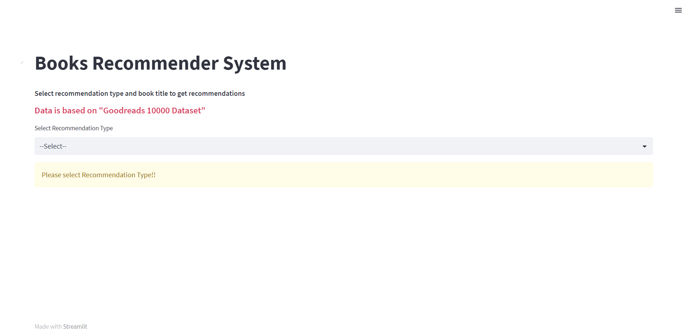
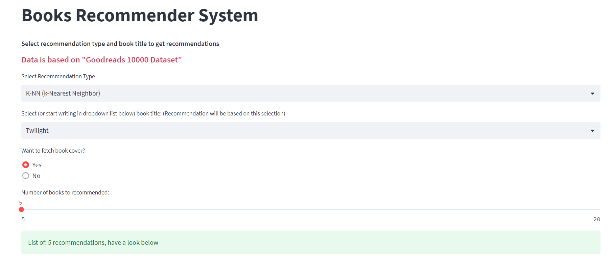

# Books Recommender System

System recommends books using the K-Nearest Neighbours and Cosine Similarity algorithms from a list of 10000 books with 1 million ratings

## Requirements
Python version: 3.10.2  
Python modules: streamlit, numpy, Pillow, pandas, urllib3, scikit-learn

## Dataset
- [goodbooks-10k](https://www.kaggle.com/datasets/zygmunt/goodbooks-10k)

Dataset contains ratings (go from 1 to 5) for 10000 books. Unique number of every book 

The most important file is books.csv which has metadata for each book (goodreads IDs, authors, title, average rating, etc.).

I used book IDs and user IDs in recommending process. For books, they are 1-10000, for users, 1-53424. Every user has made at least two ratings. 

## Goals
- use 2 recommend methods: KNN, Cosine Similarity
- compare these 2 methods
- build web-app which display titles with some basic data and with picture of book cover

## Files
- `app.py` the main file of streamlit web-app, have to be runned in by command 'streamlit run'
- `knn.py` python file containing a k-NN Algorithm
- `cossim.py` python file containing a Cosine Similarity Algorithm
- `Analysis of dataset.ipynb` draft jupyter notebook with some helpful charts, commands, not included in app.
- `requirements.txt` text file with names of needed python modules


## Running application
- Clone repo
- Open cmd prompt in working directory
- Run command:
  ```
  pip install -r requirements.txt
  ```
- To run app, write following command in cmd prompt
  ```
  streamlit run app.py
  ```
- Then wait a moment, after few seconds you shoulds following code:
```
  You can now view your Streamlit app in your browser.

  Local URL: http://localhost:8501
  Network URL: http://192.168.1.1:8501
```
And web-app should open in your browser. If not just copy and paste link `Local URL` or `Network URL`

## Screenshots

After page is loaded you shold see following view:  



Input page for k-NN (same for Cosine Similarity)



Example results of recommendation:


## Recommenders

I used two very popular ways to build a recommendation system:

### Content Based Filtering

 Content-based filtering is to use content or different attributes  e.g tag products, keywords. To understand behaviour of the single user, method looks up keywords in the database and recommend products with the identical attributes.

#### Cosine Similarity 
To perform this I used the Cosine Similarity to calculate a numeric distance between two books. Cosine Similarity, it is defined as following:

$cosine(x,y) = \frac{x. y^\intercal}{||x||.||y||} $

It computes similarity between every pair of books and then suggests books by simply choosing and compering similarity values to a particular book that user liked. Books with the lowest result of similarity are (according to system) recommendable. To build this recommender used the following book's attributes: *title*, *authors* and *average_rating*.

### Collaborative Filtering 

Collaborative Filtering is using the idea that next user's choice will be similar as previous choices. In this method the features are not used to recommend, rather clustering is used. 

## KNN

A recommender system k-Nearest Neighbor (k-NN) based is a one of collaborative filtering systems that uses the ratings (from users) to recommend. k-NN calculate the similarity between each pair of items, and then system (using these values) try to estimate how this specific user will rate a given item. k-NN is used here to find clusters of similar users based on *book_id*, *rating* and *user_id* and make predictions using rating of top-k nearest neighbors.

## Conclusion
For these data I think that Cosine Similarity gives better recommensations than k-NN. It can be caused by the fact that some user didn't rate so many books e.g some users give ratings only to 2 books.

